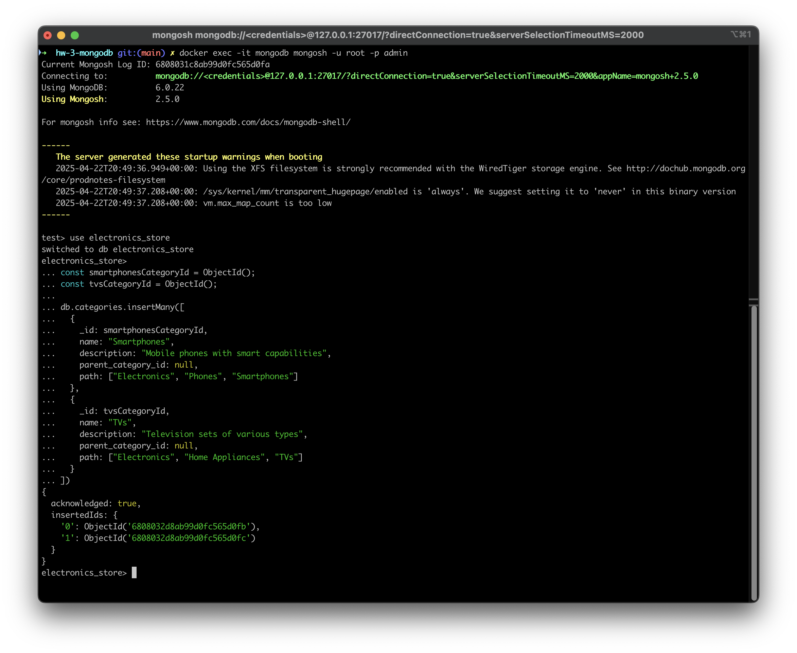
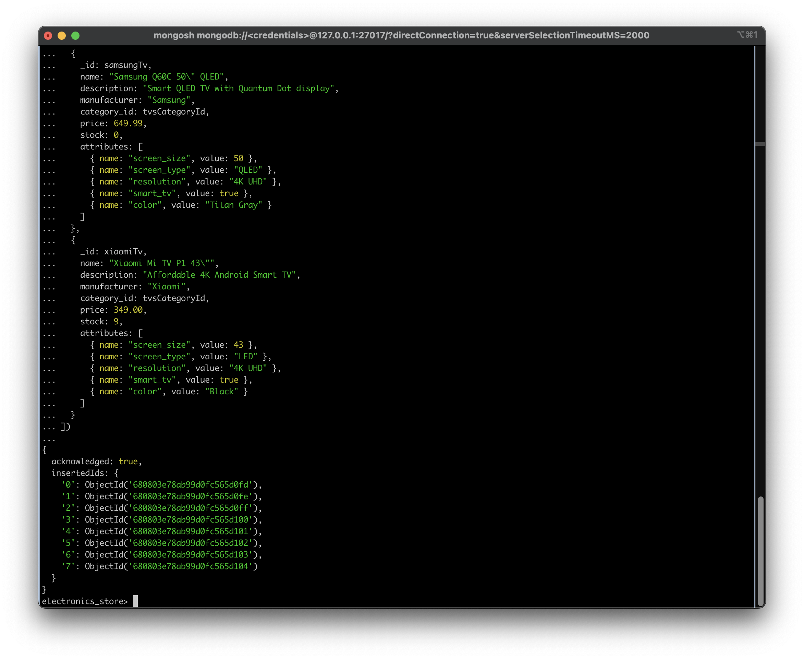
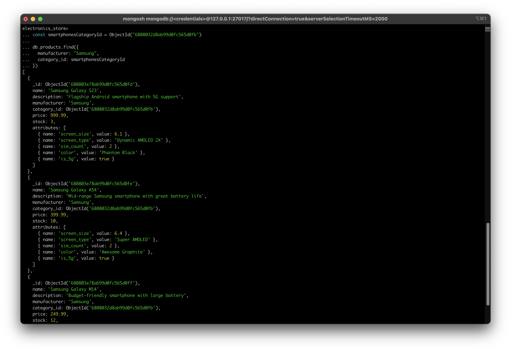
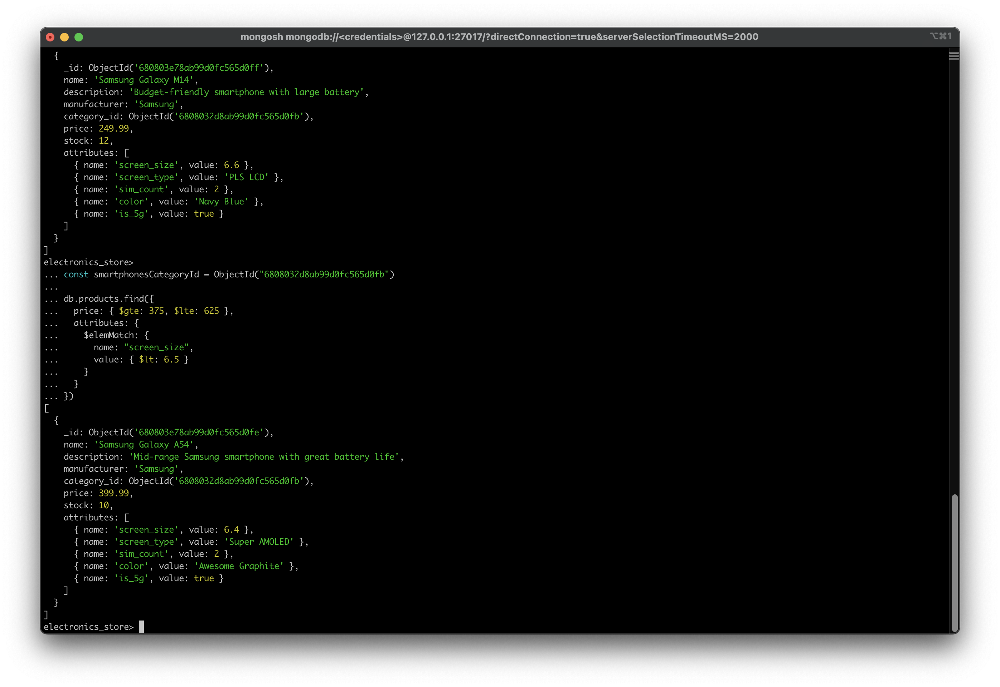
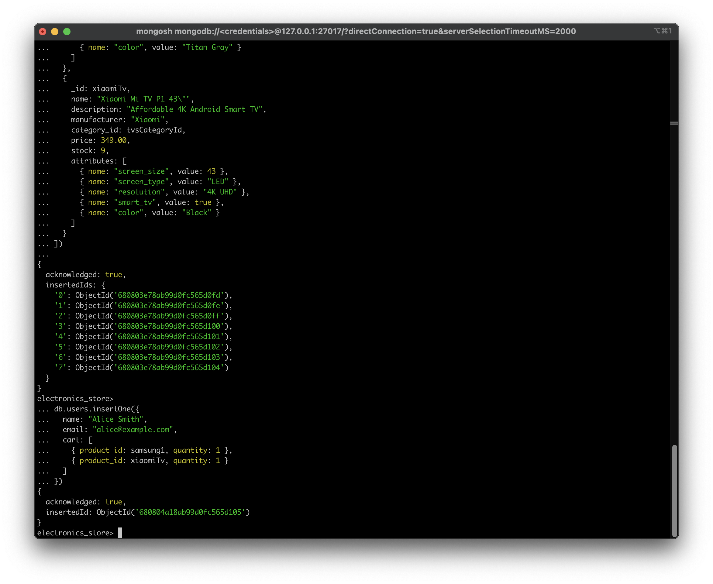
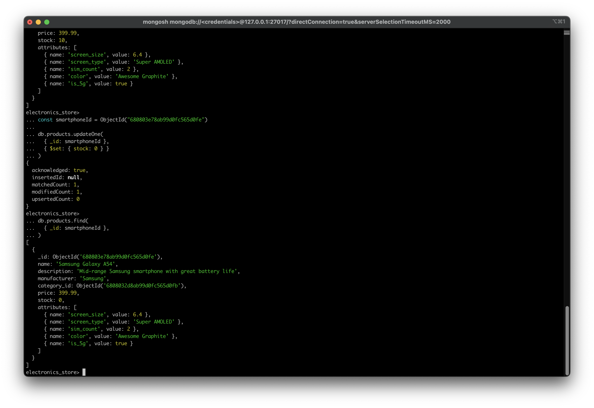

# HW 3

## DB design

### 1. User schema

```json
{
    "$jsonSchema": {
        "bsonType": "object",
        "properties": {
            "_id": { "bsonType": "objectId" },
            "name": { "bsonType": "string" },
            "email": { "bsonType": "string" },
            "cart": {
                "bsonType": "array",
                "items": {
                    "bsonType": "object",
                    "required": ["product_id", "quantity"],
                    "properties": {
                        "product_id": { "bsonType": "objectId" },
                        "quantity": { "bsonType": "int" }
                    },
                    "additionalProperties": false
                }
            }
        }
    }
}
```

### 2. Product schema

```json
{
    "$jsonSchema": {
        "bsonType": "object",
        "properties": {
            "_id": { "bsonType": "objectId" },
            "name": { "bsonType": "string" },
            "description": { "bsonType": "string" },
            "manufacturer": { "bsonType": "string" },
            "category_id": { "bsonType": "objectId" },
            "price": { "bsonType": "double" },
            "stock": { "bsonType": "int" },
            "attributes": {
                "bsonType": "array",
                "items": {
                    "bsonType": "object",
                    "required": ["name", "value"],
                    "properties": {
                        "name": { "bsonType": "string" },
                        "value": {
                            "oneOf": [
                                { "bsonType": "string" },
                                { "bsonType": "double" },
                                { "bsonType": "int" },
                                { "bsonType": "bool" }
                            ]
                        }
                    },
                    "additionalProperties": false
                }
            }
        }
    }
}
```

## 3. Category schema

```json
{
    "$jsonSchema": {
        "bsonType": "object",
        "properties": {
            "_id": { "bsonType": "objectId" },
            "name": { "bsonType": "string" },
            "description": { "bsonType": "string" },
            "parent_category_id": { "bsonType": "objectId" },
            "path": {
                "bsonType": "array",
                "items": { "bsonType": "string" }
            }
        },
        "required": ["name", "path"],
        "additionalProperties": false
    }
}
```

## Data examples

```json
[
  {
    "name": "Samsung Galaxy S23",
    "description": "Flagship Android smartphone with 5G support",
    "manufacturer": "Samsung",
    "category_id": ObjectId("CATEGORY_SMARTPHONES"),
    "price": 999.99,
    "stock": 3,
    "attributes": [
      { "name": "screen_size", "value": 6.1 },
      { "name": "screen_type", "value": "Dynamic AMOLED 2X" },
      { "name": "sim_count", "value": 2 },
      { "name": "color", "value": "Phantom Black" },
      { "name": "is_5g", "value": true }
    ]
  },
  {
    "name": "Samsung Galaxy A54",
    "description": "Mid-range Samsung smartphone with great battery life",
    "manufacturer": "Samsung",
    "category_id": ObjectId("CATEGORY_SMARTPHONES"),
    "price": 399.99,
    "stock": 10,
    "attributes": [
      { "name": "screen_size", "value": 6.4 },
      { "name": "screen_type", "value": "Super AMOLED" },
      { "name": "sim_count", "value": 2 },
      { "name": "color", "value": "Awesome Graphite" },
      { "name": "is_5g", "value": true }
    ]
  },
  {
    "name": "Samsung Galaxy M14",
    "description": "Budget-friendly smartphone with large battery",
    "manufacturer": "Samsung",
    "category_id": ObjectId("CATEGORY_SMARTPHONES"),
    "price": 249.99,
    "stock": 12,
    "attributes": [
      { "name": "screen_size", "value": 6.6 },
      { "name": "screen_type", "value": "PLS LCD" },
      { "name": "sim_count", "value": 2 },
      { "name": "color", "value": "Navy Blue" },
      { "name": "is_5g", "value": true }
    ]
  },
  {
    "name": "iPhone 15",
    "description": "Latest Apple smartphone with A16 chip",
    "manufacturer": "Apple",
    "category_id": ObjectId("CATEGORY_SMARTPHONES"),
    "price": 1099.00,
    "stock": 0,
    "attributes": [
      { "name": "screen_size", "value": 6.1 },
      { "name": "screen_type", "value": "OLED" },
      { "name": "sim_count", "value": 1 },
      { "name": "color", "value": "Blue" },
      { "name": "is_5g", "value": true }
    ]
  },
  {
    "name": "Xiaomi Redmi Note 12",
    "description": "Affordable smartphone with AMOLED display",
    "manufacturer": "Xiaomi",
    "category_id": ObjectId("CATEGORY_SMARTPHONES"),
    "price": 199.99,
    "stock": 4,
    "attributes": [
      { "name": "screen_size", "value": 6.67 },
      { "name": "screen_type", "value": "AMOLED" },
      { "name": "sim_count", "value": 2 },
      { "name": "color", "value": "Mint Green" },
      { "name": "is_5g", "value": false }
    ]
  }
]
```

```json
[
  {
    "name": "LG OLED C3 55\"",
    "description": "Premium OLED TV with perfect blacks and Dolby Vision",
    "manufacturer": "LG",
    "category_id": ObjectId("CATEGORY_TVS"),
    "price": 1399.99,
    "stock": 1,
    "attributes": [
      { "name": "screen_size", "value": 55 },
      { "name": "screen_type", "value": "OLED" },
      { "name": "resolution", "value": "4K UHD" },
      { "name": "smart_tv", "value": true },
      { "name": "color", "value": "Black" }
    ]
  },
  {
    "name": "Samsung Q60C 50\" QLED",
    "description": "Smart QLED TV with Quantum Dot display",
    "manufacturer": "Samsung",
    "category_id": ObjectId("CATEGORY_TVS"),
    "price": 649.99,
    "stock": 0,
    "attributes": [
      { "name": "screen_size", "value": 50 },
      { "name": "screen_type", "value": "QLED" },
      { "name": "resolution", "value": "4K UHD" },
      { "name": "smart_tv", "value": true },
      { "name": "color", "value": "Titan Gray" }
    ]
  },
  {
    "name": "Xiaomi Mi TV P1 43\"",
    "description": "Affordable 4K Android Smart TV",
    "manufacturer": "Xiaomi",
    "category_id": ObjectId("CATEGORY_TVS"),
    "price": 349.00,
    "stock": 9,
    "attributes": [
      { "name": "screen_size", "value": 43 },
      { "name": "screen_type", "value": "LED" },
      { "name": "resolution", "value": "4K UHD" },
      { "name": "smart_tv", "value": true },
      { "name": "color", "value": "Black" }
    ]
  }
]
```

## Usage examples

### Inserting categories

```js
const smartphonesCategoryId = ObjectId();
const tvsCategoryId = ObjectId();
...
db.categories.insertMany([
  {
    _id: smartphonesCategoryId,
    name: "Smartphones",
    description: "Mobile phones with smart capabilities",
    parent_category_id: null,
    path: ["Electronics", "Phones", "Smartphones"]
  },
  {
    _id: tvsCategoryId,
    name: "TVs",
    description: "Television sets of various types",
    parent_category_id: null,
    path: ["Electronics", "Home Appliances", "TVs"]
  }
])
```



### Inserting products

```js
const samsung1 = ObjectId();
const samsung2 = ObjectId();
const samsung3 = ObjectId();
const iphone15 = ObjectId();
const xiaomiPhone = ObjectId();
const lgTv = ObjectId();
const samsungTv = ObjectId();
const xiaomiTv = ObjectId();

db.products.insertMany([
  {
    _id: samsung1,
    name: "Samsung Galaxy S23",
    description: "Flagship Android smartphone with 5G support",
    manufacturer: "Samsung",
    category_id: smartphonesCategoryId,
    price: 999.99,
    stock: 3,
    attributes: [
      { name: "screen_size", value: 6.1 },
      { name: "screen_type", value: "Dynamic AMOLED 2X" },
      { name: "sim_count", value: 2 },
      { name: "color", value: "Phantom Black" },
      { name: "is_5g", value: true }
    ]
  },
  {
    _id: samsung2,
    name: "Samsung Galaxy A54",
    description: "Mid-range Samsung smartphone with great battery life",
    manufacturer: "Samsung",
    category_id: smartphonesCategoryId,
    price: 399.99,
    stock: 10,
    attributes: [
      { name: "screen_size", value: 6.4 },
      { name: "screen_type", value: "Super AMOLED" },
      { name: "sim_count", value: 2 },
      { name: "color", value: "Awesome Graphite" },
      { name: "is_5g", value: true }
    ]
  },
  {
    _id: samsung3,
    name: "Samsung Galaxy M14",
    description: "Budget-friendly smartphone with large battery",
    manufacturer: "Samsung",
    category_id: smartphonesCategoryId,
    price: 249.99,
    stock: 12,
    attributes: [
      { name: "screen_size", value: 6.6 },
      { name: "screen_type", value: "PLS LCD" },
      { name: "sim_count", value: 2 },
      { name: "color", value: "Navy Blue" },
      { name: "is_5g", value: true }
    ]
  },
  {
    _id: iphone15,
    name: "iPhone 15",
    description: "Latest Apple smartphone with A16 chip",
    manufacturer: "Apple",
    category_id: smartphonesCategoryId,
    price: 1099.00,
    stock: 0,
    attributes: [
      { name: "screen_size", value: 6.1 },
      { name: "screen_type", value: "OLED" },
      { name: "sim_count", value: 1 },
      { name: "color", value: "Blue" },
      { name: "is_5g", value: true }
    ]
  },
  {
    _id: xiaomiPhone,
    name: "Xiaomi Redmi Note 12",
    description: "Affordable smartphone with AMOLED display",
    manufacturer: "Xiaomi",
    category_id: smartphonesCategoryId,
    price: 199.99,
    stock: 4,
    attributes: [
      { name: "screen_size", value: 6.67 },
      { name: "screen_type", value: "AMOLED" },
      { name: "sim_count", value: 2 },
      { name: "color", value: "Mint Green" },
      { name: "is_5g", value: false }
    ]
  },
  {
    _id: lgTv,
    name: "LG OLED C3 55\"",
    description: "Premium OLED TV with perfect blacks and Dolby Vision",
    manufacturer: "LG",
    category_id: tvsCategoryId,
    price: 1399.99,
    stock: 1,
    attributes: [
      { name: "screen_size", value: 55 },
      { name: "screen_type", value: "OLED" },
      { name: "resolution", value: "4K UHD" },
      { name: "smart_tv", value: true },
      { name: "color", value: "Black" }
    ]
  },
  {
    _id: samsungTv,
    name: "Samsung Q60C 50\" QLED",
    description: "Smart QLED TV with Quantum Dot display",
    manufacturer: "Samsung",
    category_id: tvsCategoryId,
    price: 649.99,
    stock: 0,
    attributes: [
      { name: "screen_size", value: 50 },
      { name: "screen_type", value: "QLED" },
      { name: "resolution", value: "4K UHD" },
      { name: "smart_tv", value: true },
      { name: "color", value: "Titan Gray" }
    ]
  },
  {
    _id: xiaomiTv,
    name: "Xiaomi Mi TV P1 43\"",
    description: "Affordable 4K Android Smart TV",
    manufacturer: "Xiaomi",
    category_id: tvsCategoryId,
    price: 349.00,
    stock: 9,
    attributes: [
      { name: "screen_size", value: 43 },
      { name: "screen_type", value: "LED" },
      { name: "resolution", value: "4K UHD" },
      { name: "smart_tv", value: true },
      { name: "color", value: "Black" }
    ]
  }
])
```



### Show smartphones per manufacturer

```js
const smartphonesCategoryId = ObjectId("6808032d8ab99d0fc565d0fb")

db.products.find({
  manufacturer: "Samsung",
  category_id: smartphonesCategoryId
})
```



### Show smartphones with price between 375 - 625 amd screen size lower then 6.5"

```js
const smartphonesCategoryId = ObjectId("6808032d8ab99d0fc565d0fb")

db.products.find({
  price: { $gte: 375, $lte: 625 },
  attributes: {
    $elemMatch: {
      name: "screen_size",
      value: { $lt: 6.5 }
    }
  }
})
```



### Creating user cart

```js
db.users.insertOne({
  name: "Alice Smith",
  email: "alice@example.com",
  cart: [
    { product_id: samsung1, quantity: 1 },
    { product_id: xiaomiTv, quantity: 1 }
  ]
})
```



### Update stock

```js
const smartphoneId = ObjectId("680803e78ab99d0fc565d0fe")

db.products.updateOne(
  { _id: smartphoneId },
  { $set: { stock: 0 } }
)

db.products.find(
  { _id: smartphoneId }
)
```

